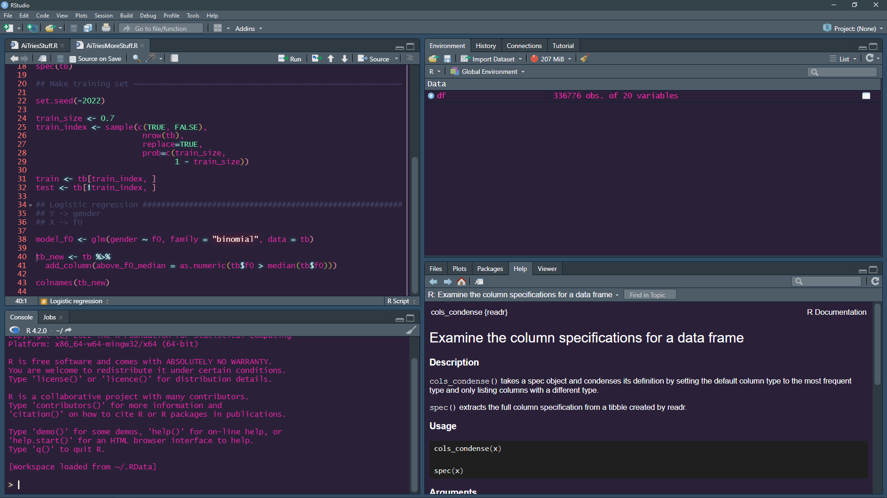

# `tabula-rasa/R/01/solution.md`

[📝 HW link](https://titus.techtalentsouth.com/mod/assign/view.php?id=56535)

## What is an IDE?

IDE stands for "integrated development environment" -- it allows you to edit the source code of specific languages it supports as well as provides other features specific to that language such as compiling, debugging, viewing outputs, looking up documentation, etc.

## Why use Anaconda?

~~No, use [mambaforge](https://mamba.readthedocs.io/en/latest/installation.html) or at least [miniconda](https://docs.conda.io/en/latest/miniconda.html) instead and install what you need in [conda virtual environments](https://docs.conda.io/projects/conda/en/latest/user-guide/tasks/manage-environments.html).~~

Installing and using Anaconda allows you to use python with various standard data science packages without having to mess around with command line heckery.

## Can we use R from within jupyter notebook?

Yes. For example, see these [instructions](https://datatofish.com/r-jupyter-notebook/).

## What is R?

R is a programming language for statistical computing.

## Who uses R?

Statisticians, statistics grad students, and probably many folks in statistics-adjacent fields such as the social sciences who need to do mathematically rigorous statistical analysis.

## How is R different from python?

R is a lanaguage specifically focused on statistical computing unlike python which is a general programming language which happens to have an ecosystem of packages which greatly facilitates doing data science.

## What is R Studio?

R Studio is a popular IDE for R.

## What is a script?

A script is a standalone file of saved code, i.e. code that exists outside of your terminal command history.

## What is a notebook?

A notebook is an interactive programming environment where you have non-code comments such as markdown and code cells where you can run to view outputs directly in the notebook.

## Post a picture/screencap of the R studio screen and explain the different parts like the console

- Quadrant I -> variables
- Quadrant II -> script source code
- Quandrant III -> R console
- Quandrant IV -> Docs

## What is the difference between R Notebook - R Markdown - Jupyter Notebook

R notebooks are interactive markdown files (`.Rmd` i.e. R Markdown files) that you can run R code in. They originated with R Studio but can also be run in IDE's like VS Code nowadays. Jupyter notebooks are technically JSON files which can be opened as local web servers that provide similar markdown plus code cell environments but also support various languages such as Python, R, and Julia.
