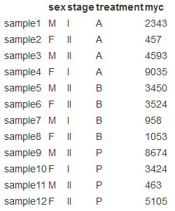
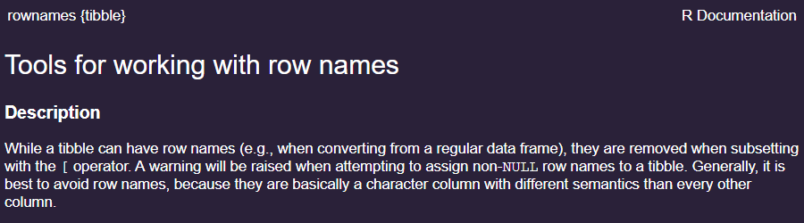

[HW link](https://titus.techtalentsouth.com/mod/assign/view.php?id=56536)

## Import packages

```{r}
library(tidyverse)
```

## Creating vectors/factors and dataframes

We are performing RNA-Seq on cancer samples being treated with three different types of treatment (`A`, `B`, and `P`). You have 12 samples total, with 4 replicates per treatment. Write the R code you would use to construct your metadata table as described below.



### Create the vectors/factors for each column (Hint: you can type out each vector/factor, or if you want the process to go faster try exploring the `rep()` function)

```{r}
sex <- rep(c("M", "F"), 6)
stage <- rep(c("I", "II", "III"), 4)
treatment <- rep(c("A", "B", "P"), 
                 as.integer(rep(4, 3)))
myc <- c(2343, 457, 4593, 9035, 3450, 3524, 
         958, 1053, 8674, 3424, 463, 5105)
```

### Put them together into a dataframe called `meta`

```{r}
meta <- tibble(sex, stage, treatment, myc)

rm(sex, stage, treatment, myc)
```

### Use the `rownames()` function to assign row names to the dataframe (Hint: you can type out the row names as a vector, or if you want the process to go gaster try exploring the paste() function).

The tibbles docs suggest that row names are bad practice:

 So we will make an ordinary column called `rownames` instead.

```{r}
meta <- meta %>%
  mutate(rownames = paste0("sample", 1:12)) %>%
  select(rownames, everything())
```

So our final `meta` tibble looks like

```{r}
meta
```

## Subsetting vectors/factors and dataframes

Using the `meta` dataframe from above, write out the R code you would use to perform the following operations (questions **DO NOT** buld upon each other):

### return only the `treatment` and `sex` columns using `[]`:

```{r}
meta[, c("treatment", "sex")]
```

### return the `treatment` values for samples $5, 7, 9,$ and $10$ using `[]`:

```{r}
meta[c(5, 7, 9, 10), c("rownames", "treatment")]
```

### use `subset()` to return all data for those samples receiving treatment `P`:

```{r}
subset(meta, treatment == "P")
```

### use `filter()`/`select()` to return only the `stage` and `treatment` columns for those samples `myc` $> 5000$:

```{r}
meta %>%
  select(rownames, stage, treatment, myc) %>%
  filter(myc > 5000) %>%
  select(rownames, stage, treatment)
```

### remove the `treatment` column from the dataset using `[]`:

```{r}
treatment_index <- which(colnames(meta) == "treatment")
meta[, -treatment_index]
```

### remove samples $7, 8,$ and $9$ from the dataset using `[]`:

```{r}
indices <- which(deframe(meta[, "rownames"]) %in% paste0("sample", 7:9))
meta[-indices, ]
```

### keep only samples $1-6$ using `[]`:

```{r}
indices <- which(deframe(meta[, "rownames"]) %in% paste0("sample", 1:6))
meta[indices, ]
```

### add a column called `pre_treatment` to the beginning of the dataframe with values `T, F, F, F, T, T, F, T, F, F, T, T` (Hint: use `cbind()`):

```{r}
pre_treatment <- c("T", "F", "F", "F", "T", "T",
                   "F", "T", "F", "F", "T", "T")
cbind(meta[, "rownames"], pre_treatment, meta[, -1])
```

### change the names of the columns to `A`, `B`, `C`, `D`:

```{r}
original_col <- colnames(meta) 
colnames(meta)[-1] <- c("A", "B", "C", "D")
meta
```