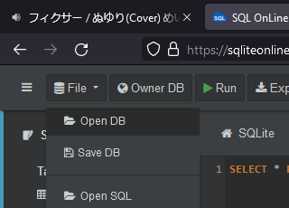

# `SQL/01/01.md`

[HW link](https://titus.techtalentsouth.com/mod/assign/view.php?id=56523)

---

## Grading

**Skip to [Question 1](#1) to immediately start grading.**

The following few sections will simply reproduce the [sqliteonline](https://sqliteonline.com/) database in the [slides](https://techtalentsouth.slides.com/techtalentsouth/sql-part-2-sql-fundamentals?token=B8p0vSeF#/0/26) so that anyone can easily test the queries in this repo without having to dig up old TTS links.

<div id=1></div>

## Upload database to sqliteonline

Go to [sqliteonline](https://sqliteonline.com/) and upload `SQL/data/my_ipod.sqlite3` by clicking

```
File -> Open DB
```



## Create `User` and `Favorite` table

Run

```
CREATE TABLE User
(
	UserID INTEGER PRIMARY KEY AUTOINCREMENT NOT NULL,
	FirstName VARCHAR NOT NULL,
	LastName VARCHAR NOT NULL,
	Birthplace VARCHAR NOT NULL,
	CreatedAt DATETIME NOT NULL,
	UpdatedAt DATETIME NULL
);

CREATE TABLE Favorite
(
	FavoriteID INTEGER PRIMARY KEY AUTOINCREMENT NOT NULL,
	UserID INTEGER NOT NULL,
	ArtistID INTEGER,
	AlbumID INTEGER,
	SongID INTEGER,
	GenreID INTEGER,
	CreatedAt DATETIME NOT NULL,
	UpdatedAt DATETIME NULL,
	FOREIGN KEY (UserID) REFERENCES User (UserID),
	FOREIGN KEY (ArtistID) REFERENCES artists (id),
	FOREIGN KEY (AlbumID) REFERENCES albums (id),
	FOREIGN KEY (SongID) REFERENCES songs (id),
	FOREIGN KEY (GenreID) REFERENCES genres (id)
);
```

in the query box. For example, you can high-light all the code you pasted in the command box by hitting `CTRL + A` on Windows and then press `SHIFT + ENTER` to run the commands.

## 🔖 Question 1

`SELECT` everything from a table

### Solution

TBA
