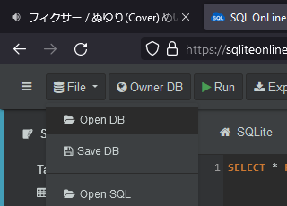

# `tabula-rasa/SQL/02/02.md`

[HW link](https://titus.techtalentsouth.com/mod/assign/view.php?id=56524)

---

## Upload database to sqliteonline

Go to [sqliteonline](https://sqliteonline.com/) and upload `SQL/data/02/02_before_solution.db` by clicking

```
File -> Open DB
```



You can also upload `SQL/data/01/02_after_solution.db` to see the database after all the following commands are run.

## Question 1

`UPDATE` the `favorite` table (don't forget to set `UpdatedAt` to `CURRENT_TIMESTAMP`!) so that every record but two have a favorite song (`SongID`), genre (`GenreID`), artist (`ArtistID`), and album (`AlbumID`)

### Solution

We will manually run 12 queries to insert the random records (`../data/02/sample_songs_-6022022.csv`) generated by `./02.R`. It's possible to use another R script with [RSQLite](https://rsqlite.r-dbi.org/) again in order to do this more efficiently, but we will continue with [sqliteonline](https://sqliteonline.com/) for consistency.

```
UPDATE Favorite
SET songid = 785,
	albumid = 70,
    genreid = 12,
    artistid = 56,
	updatedat = CURRENT_TIMESTAMP
WHERE favoriteid = 2;

UPDATE Favorite
SET songid = 628,
	albumid = 59,
    genreid = 4,
    artistid = 47,
	updatedat = CURRENT_TIMESTAMP
WHERE favoriteid = 4;

UPDATE Favorite
SET songid = 100,
	albumid = 18,
    genreid = 9,
    artistid = 18,
	updatedat = CURRENT_TIMESTAMP
WHERE favoriteid = 1;

UPDATE Favorite
SET songid = 105,
	albumid = 19,
    genreid = 9,
    artistid = 18,
	updatedat = CURRENT_TIMESTAMP
WHERE favoriteid = 14;

UPDATE Favorite
SET songid = 654,
	albumid = 61,
    genreid = 4,
    artistid = 49,
	updatedat = CURRENT_TIMESTAMP
WHERE favoriteid = 6;

UPDATE Favorite
SET songid = 461,
	albumid = 45,
    genreid = 9,
    artistid = 36,
	updatedat = CURRENT_TIMESTAMP
WHERE favoriteid = 5;

UPDATE Favorite
SET songid = 353,
	albumid = 36,
    genreid = 12,
    artistid = 29,
	updatedat = CURRENT_TIMESTAMP
WHERE favoriteid = 9;

UPDATE Favorite
SET songid = 763,
	albumid = 68,
    genreid = 5,
    artistid = 55,
	updatedat = CURRENT_TIMESTAMP
WHERE favoriteid = 12;

UPDATE Favorite
SET songid = 633,
	albumid = 59,
    genreid = 4,
    artistid = 47,
	updatedat = CURRENT_TIMESTAMP
WHERE favoriteid = 11;

UPDATE Favorite
SET songid = 189,
	albumid = 25,
    genreid = 14,
    artistid = 22,
	updatedat = CURRENT_TIMESTAMP
WHERE favoriteid = 10;

UPDATE Favorite
SET songid = 612,
	albumid = 57,
    genreid = 12,
    artistid = 45,
	updatedat = CURRENT_TIMESTAMP
WHERE favoriteid = 13;

UPDATE Favorite
SET songid = 299,
	albumid = 32,
    genreid = 14,
    artistid = 26,
	updatedat = CURRENT_TIMESTAMP
WHERE favoriteid = 3;
```

```
SELECT * FROM Favorite;
```

## Question 2

Starting from the `User` table, get the name of every `User` and that user's favorite song, genre, artist, and album. This will involve some `JOINs`!

### Solution

```
SELECT User.FirstName AS first_name, User.lastname AS last_name,
	songs.name AS song_name,
    genres.name AS genre_name,
    artists.name AS artist_name,
    albums.name AS album_name
FROM Favorite
INNER JOIN User on User.UserID = Favorite.UserID
INNER JOIN songs ON songs.id = Favorite.songid
INNER JOIN genres ON genres.id = Favorite.GenreID
INNER JOIN artists on artists.id = Favorite.artistid
INNER JOIN albums ON albums.id = Favorite.albumid
GROUP BY last_name
```

## Question 3

Starting from the albums table, `SELECT` every album name and its respective `ID` that are longer than 5 minutes (this will involve a `JOIN`).

### Solution

```
SELECT albums.id AS album_id,
	albums.name AS album_name,
    SUM(songs.length) AS minutes
FROM albums
INNER JOIN songs ON songs.album_id = albums.id
GROUP BY albums.id
HAVING minutes > 5
ORDER BY minutes
```
